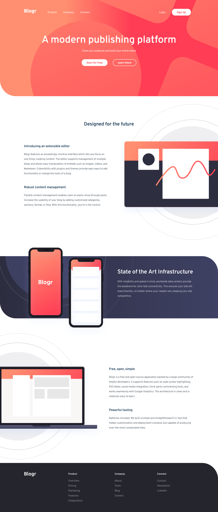

# Frontend Mentor - Blogr landing page solution

This is a solution to the [Blogr landing page challenge on Frontend Mentor](https://www.frontendmentor.io/challenges/blogr-landing-page-EX2RLAApP). Frontend Mentor challenges help you improve your coding skills by building realistic projects. 

## Table of contents

- [Overview](#overview)
  - [The challenge](#the-challenge)
  - [Screenshot](#screenshot)
  - [Links](#links)
- [My process](#my-process)
  - [Built with](#built-with)
  - [What I learned](#what-i-learned)
- [Author](#author)


## Overview

### The challenge

Users should be able to:

- View the optimal layout for the site depending on their device's screen size
- See hover states for all interactive elements on the page

### Screenshot



### Links

- Solution URL: [@gerald-tetteh/blogr](https://github.com/gerald-tetteh/Blogr-Landing-Page)
- Live Site URL: [@gerald-tetteh/github-pages](https://gerald-tetteh.github.io/Blogr-Landing-Page/)

## My process

### Built with

- Semantic HTML5 markup
- CSS custom properties
- Flexbox
- Desktop-first workflow
- [Sass](https://sass-lang.com/)

### What I learned

This project helped me apply a lot of things I had learned before and
a few new tricks. For this project I used Sass to style the page. Sass
makes responsive design easier in my opinion. I used Sass mixins to apply media queries to specific elements easily.

```scss
@mixin respond($breakPoint) {
  @if $breakPoint == phone {
    @media (max-width: 37.5em) { @content }; // 600px
  }
  @if $breakPoint == tab-port {
    @media (max-width: 56.25em) { @content }; // 900px
  }
  @if $breakPoint == tab-port-reverse {
    @media (min-width: 56.3125em) { @content }; // 900px min-width
  }
  @if $breakPoint == tab-land {
    @media (max-width: 75em) { @content }; // 1200px
  }
  @if $breakPoint == big-desktop {
    @media (min-width: 112.5em) { @content }; // 1800px
  }
}
```

I also learned how to position multiple background images in CSS.
```css
.section-art {
  background-position: 
  -18rem -53rem,
  center center;
}
```

## Author

- Website - [Gerald Addo-Tetteh](https://gerald-addo.herokuapp.com)
- Frontend Mentor - [@gerald-tetteh](https://www.frontendmentor.io/profile/gerald-tetteh)
- GitHub - [@gerald-tetteh](https://github.com/gerald-tetteh)